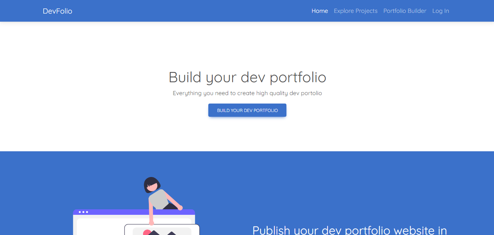
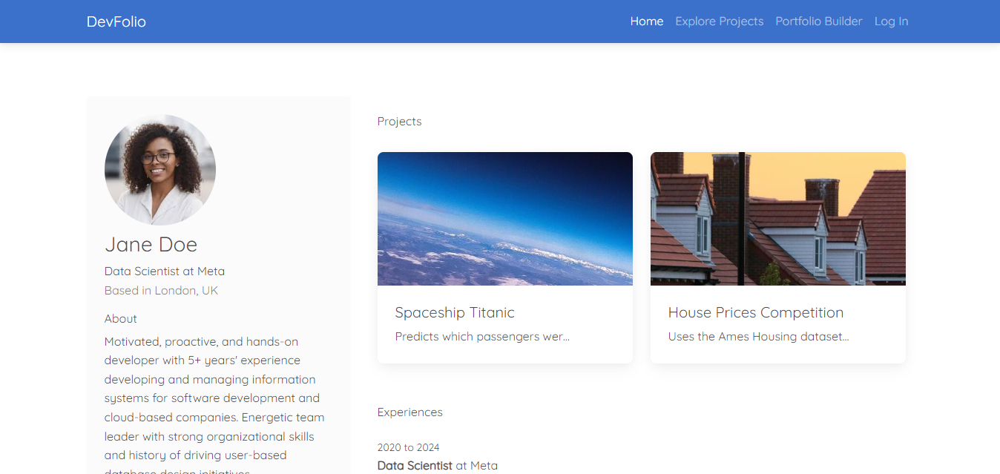
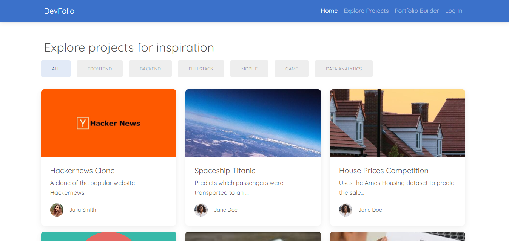

# Devfolio
Devfolio is a website that enables developers create online portfolios within minutes.





**Here are the technologies I used:**
- Python
- Django
- PostgreSQL
- Bootstrap5
- Cloudinary

## Installation
### 1. Prerequisites
Python 3.10+, Git

### 2. Clone Project
Open a terminal and run the following commands:
```bash
git clone https://github.com/emmaduru/devfolio.git
cd devfolio
```

### 3. Create virtual environment and install dependencies
```bash
pipenv install -r requirements.txt
```

### 4. Setting environment variables
Rename the .env.example file to .env and enter your personal information.
Then apply the migrations:

```bash
python manage.py migrate
```

Then launch the development server:

```bash
python manage.py runserver
```

Go to http://127.0.0.1:8000 in a web browser
